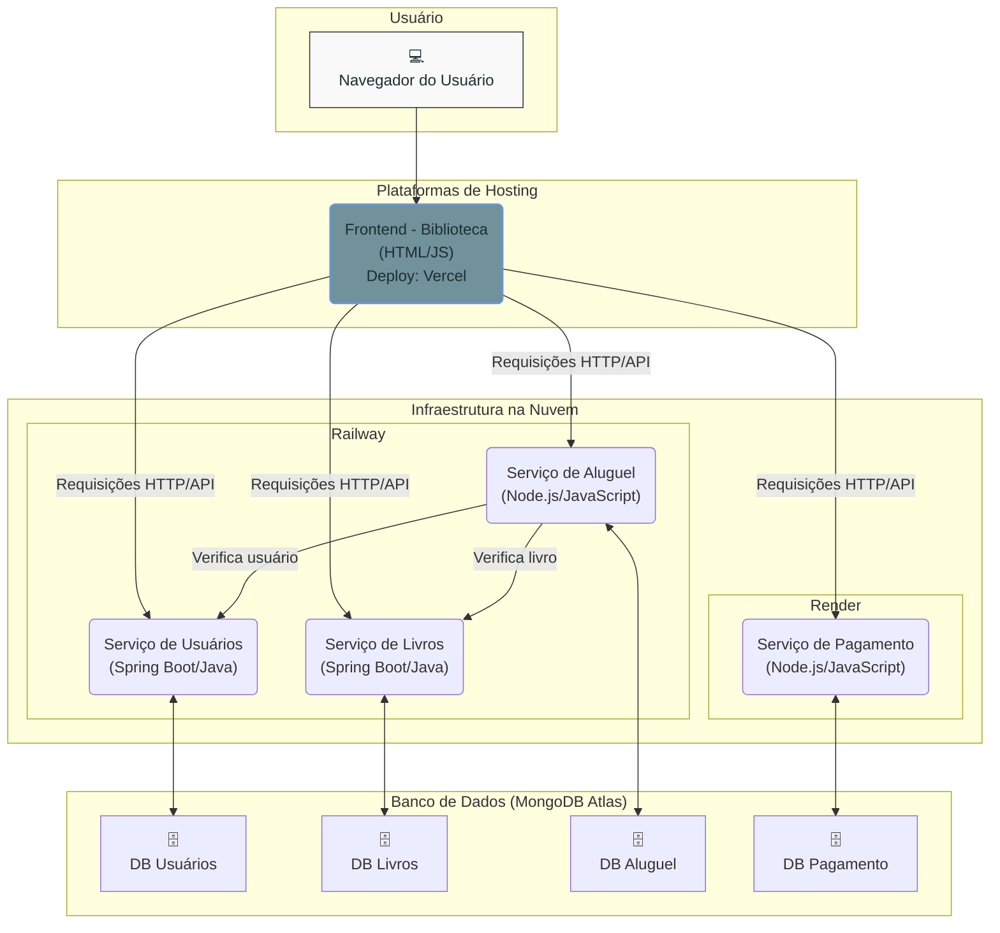

```mermaid
graph TD;
    subgraph "Usuário"
        Browser["💻<br>Navegador do Usuário"]
    end

    subgraph "Plataformas de Hosting"
        Frontend("Frontend - Biblioteca<br>(HTML/JS)<br>Deploy: Vercel")
    end

    subgraph "Infraestrutura na Nuvem"
        subgraph "Railway"
            ServiceUsuarios("Serviço de Usuários<br>(Spring Boot/Java)")
            ServiceLivros("Serviço de Livros<br>(Spring Boot/Java)")
            ServiceAluguel("Serviço de Aluguel<br>(Node.js/JavaScript)")
        end
        subgraph "Render"
            ServicePagamento("Serviço de Pagamento<br>(Node.js/JavaScript)")
        end
    end
    
    subgraph "Banco de Dados (MongoDB Atlas)"
        DB_Usuarios["🗄️<br>DB Usuários"]
        DB_Livros["🗄️<br>DB Livros"]
        DB_Aluguel["🗄️<br>DB Aluguel"]
        DB_Pagamento["🗄️<br>DB Pagamento"]
    end

    Browser --> Frontend;
    
    Frontend -->|Requisições HTTP/API| ServiceUsuarios;
    Frontend -->|Requisições HTTP/API| ServiceLivros;
    Frontend -->|Requisições HTTP/API| ServiceAluguel;
    Frontend -->|Requisições HTTP/API| ServicePagamento;

    ServiceUsuarios <--> DB_Usuarios;
    ServiceLivros <--> DB_Livros;
    ServiceAluguel <--> DB_Aluguel;
    ServicePagamento <--> DB_Pagamento;
    
    ServiceAluguel -->|Verifica usuário| ServiceUsuarios;
    ServiceAluguel -->|Verifica livro| ServiceLivros;

    style Frontend fill:#71919B,stroke:#6b95d4,stroke-width:2px;
    style Browser fill:#f9f9f9,stroke:#333;
    style Frontend color:#1D2E33;
    style Browser color:#1D2E33;
```
